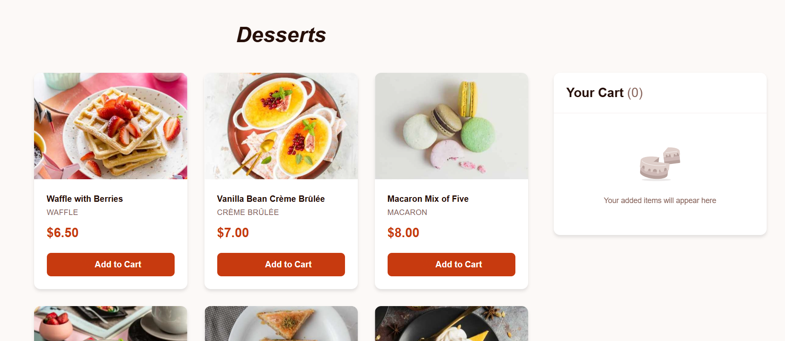
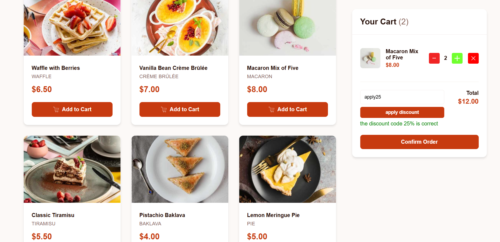

## 🛒 Summary

This is my first task for Konnecta Internship. Product List With Cart is a task from [frontend mentor](https://www.frontendmentor.io/challenges/product-list-with-cart-5MmqLVAp_d). It Built with HTML , CSS , JS.

## 🛒 Functionalities

This project implements a simple yet effective **Point of Sale (POS)** system with the following key features:

- **Add Products to Cart:** Users can see all products and add them to their shopping cart with quantity controls.
- **Discount Code Support:**  
  - `apply10` — Applies a 10% discount  
  - `apply25` — Applies a 25% discount
- **PDF Receipt Generation:** Generates a detailed, downloadable receipt using the `jsPDF` library, including all cart items and the final amount after discounts.
- **Optimized Performance:** Product images utilize **lazy loading** to speed up page load times and reduce bandwidth consumption.
- **Modular JavaScript Architecture:** Codebase is organized into well-separated modules (`main.js`, `uiHandlers.js`, etc.) for improved maintainability.


## 🌐 Live preview

- This is live url for the project deployed through netlify [Live preview](https://cartgenie.netlify.app/task01-productlistwithcart/index.html).
- This is Recorded Video For Testing The Functionalities of website [Live Video](https://drive.google.com/file/d/10RJF8oh3vLf3nL4o8zbf-Ow_i95tWc-g/view?usp=drive_link)

## 💻 Installation

```bash
# initialize the git repo
git init

# add remote access
git add remote access origin https://github.com/7azemmm/Konecta-Internship.git

# pull the repo
git pull
```
## 🚀 Running the Code

1. Install the **Live Server** extension from the [VS Code Marketplace](https://marketplace.visualstudio.com/items?itemName=ritwickdey.LiveServer).
2. Open the project folder in **Visual Studio Code**.
3. Right-click on `index.html`.
4. Select **"Open with Live Server"** from the menu.

## 🖼️ Images from the website

<br>
<br>



