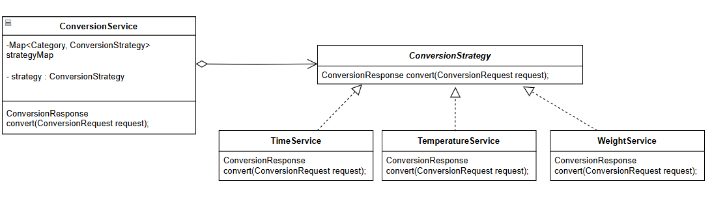
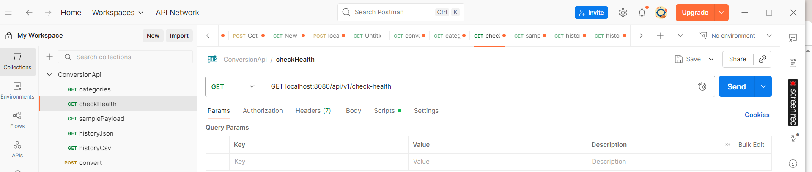

# Converter API

A Spring Boot REST API that provides unit conversion capabilities for temperature, weight, and time measurements.

## Features

- **Temperature Conversions**: Celsius, Fahrenheit, Kelvin
- **Weight Conversions**: Kilograms, Pounds, Ounces, Grams
- **Time Conversions**: Seconds, Minutes, Hours, Days
- **RESTful API**: Clean REST endpoints with proper HTTP status codes
- **Input Validation**: Comprehensive validation with Jakarta Validation and meaningful error messages
- **Code Quality**: Uses Lombok for reduced boilerplate code
- **API Testing**: Includes ApiTest.http file for convenient API testing
- **Swagger Documentation**: Interactive API documentation

## Strategy Design Pattern

While developing the project, I noticed a lot of repetitive `if/else` and `switch` statements.  
To make the codebase more **readable**, **maintainable**, and **extensible**, I decided to implement the **Strategy Design Pattern**.

This approach allows adding new behaviors without modifying existing code, following the **Open/Closed Principle**.




## Getting Started

### Running the Application

1. Clone the repository
2. Navigate to the project directory
3. Run the application:

The application will start on `http://localhost:8080`

## API Documentation

### Swagger UI

Once the application is running, you can access the interactive API documentation at:

**Swagger UI**: http://localhost:8080/swagger-ui

### OpenAPI Specification

The OpenAPI specification is available at:

**OpenAPI JSON**: http://localhost:8080/api-docs

## API Testing

The project includes an `ApiTest.http` file for convenient API testing. You can use this file with:
- IntelliJ IDEA's built-in HTTP client
- Visual Studio Code with the REST Client extension
- Any other HTTP client that supports `.http` files
  

## API Endpoints

### Conversion Endpoints

- **POST** `/api/v1/convert` - Convert units
  - Request body: `ConversionRequest` (category, fromUnit, toUnit, value)
  - Response: `ConversionResponse` (result, formula, status)

### Metadata Endpoints

- **GET** `/api/v1/categories` - Get available conversion categories
- **GET** `/api/v1/units?category={category}` - Get available units for a category
- **GET** `/api/v1/check-health` - Health check endpoint
- **GET** `/api/v1/sample-payload` - Get sample request payload

### History Endpoints

- **GET** `/api/v1/history/csv` - Get conversion history in csv file
- **GET** `/api/v1/history/json` - Get conversion history in json 

## Supported Conversions

### Temperature
- Celsius ↔ Fahrenheit
- Celsius ↔ Kelvin
- Fahrenheit ↔ Kelvin

### Weight
- Kilograms ↔ Pounds
- Kilograms ↔ Ounces
- Kilograms ↔ Grams
- Pounds ↔ Ounces
- Pounds ↔ Grams
- Ounces ↔ Grams

### Time
- Seconds ↔ Minutes
- Seconds ↔ Hours
- Seconds ↔ Days
- Minutes ↔ Hours
- Minutes ↔ Days
- Hours ↔ Days

## Validation

The API uses Jakarta Validation annotations to ensure data integrity:
- Required fields validation
- positive value validation


## Error Handling

The API provides comprehensive error handling with appropriate HTTP status codes:

- **400 Bad Request**: Invalid units, unsupported conversions, or validation errors
- **500 Internal Server Error**: Unexpected server errors

Error responses include detailed messages to help with debugging and proper API usage.

## Development

### Project Structure

```
src/main/java/com/example/ConverterApi/
├── Controllers/          # REST controllers
├── Services/            # Business logic services
├── Models/              # Data models (using Lombok annotations)
├── enums/               # Enumerations
├── Exceptions/          # Custom exceptions
├── Interfaces/          # Strategy pattern interface
└── Config/              # Configuration classes
```

### Key Dependencies

- Spring Boot Starter Web
- Spring Boot Starter Validation (Jakarta Validation)
- Lombok
- SpringDoc OpenAPI (Swagger)

### Testing

Use the provided `ApiTest.http` file to test all API endpoints quickly and efficiently. The file contains pre-configured requests for all available operations.